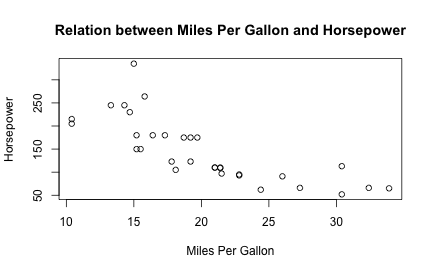
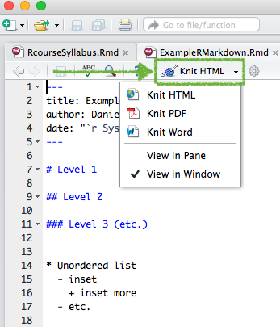

<style>
em {
  font-style: italic
}
</style>

<style>
strong {
  font-weight: bold;
}
</style>

## A couple caveats before we begin
* Much of what I'm going to be discussing is largely *not* how I have
  interacted with research to this point. Instead, it represents an ideal that I am working towards.
* None of what I will talk about should be taken as a referendum on you or
  your current practices. However, I hope to convince you that you should be working toward the reproducible research ideal, and that, as a field, we should be moving toward reproducible research being the *minimal standard*.
* I will be focusing on reproducible research with R. Other options are
  available but, in my view, none are as clear, comprehensive, and easy to implement as the tools at your disposal through R.

----
## What is reproducible research?
* **Replicability** is the gold standard for research. Ideally, most research
  would be verified through replication. 
* Reproducibility represents a minimal standard, which itself can aid
  replication (tremendously), by conducting and documenting the research sufficiently that **an independent research could reproduce all the results from a study**, provided the data were available

----
## Why should we care?
* Reproducibility as an ethical standard
	+ More transparency
	+ More potential for results to be verified (and errors found/corrected)
* If your work **is not** reproducible, it is not truly replicable.
* If your work **is** replicable, then others have a "recipe" for replication

----
## Are journal articles research? 
* Initially, we may think of journal articles as research, but really the
  research is everything that went into the article, not the article itself. 
* Some (Gandrud, 2015) conceive of the article as the "advertisement".
* If all we have is the advertisement, can we really fully understand the
  steps and decisions made during the research?  

----
## Tangential benefits
Striving toward reproducible research will:
* Make your own code more efficient/easily interpretable
	+ Can help with collaboration on a project
* Reduce errors
* Increase efficiency by not having to redo tables with each tweak to a model.

----
## What does the process actually look like?
* Start with a basic text document (not Word, text)
* Use the text document to write your article
* Embed code within the text document that corresponds to your analysis. Note
  this is not just copying the code in. The code should be live and what you're working with while conducting your research.
* Render the document into a different format (pdf, html, etc.).
	+ Select which code (if any) will be displayed
	+ Build tables of results and plots to be produced
* Readers can then read the "advertisement", but if they are interested 
  in reproducing your results (maybe because they disagree with you, or they think your results are weird and want to clearly see all the steps you took), they can access the text file that contains the computer code.
* The end result is a single product that has the advertisement and the
  research process embedded.


--- .segue
# A Quick example 

<div align = "right">

</div>

---- &twocol
## R Markdown

*** =left
* Simple language for convering R code/output into other formats, most notably 
  HTML and PDF
* These slides were produced using a varient of Markdown

*** =right
<div align = "center">

</div>

----
## YAML Front Matter

```
---
title: Example Markdown document
author: Daniel Anderson
date: "2015-09-17"
---
```


* Three dashes before and after the YAML fields
* Case sensitive
* Many other fields are possible.
  + For example, you may want to include an `output:` argument (`pdf_document`,
    `html_document`, `word_document`). Must be specified as it is rendered, if
    not supplied.


---- &twocol
## Headings and Lists

*** =left

```
# Level 1
## Level 2 
### Level 3 (etc.)
```

```
* Unordered list
  - inset
    + inset more
  - etc.

1. Ordered list
  a. blah blah
2. More stuff
```

*** =right


---- &twocol
## Code chunks

Start a code chunk with \`\`\`{r}, then produce some r code, then close the 
  chunk with three additional back ticks \`\`\`.

*** =left


```r
a <- 3
b <- 5

a + b * (exp(a)/b)
```

```
## [1] 23.08554
```

You can show code without evaluating it, using `eval = FALSE`. 


*** =right

Alternatively, you can evaluate the code without displaying it, using `echo = 
  FALSE`.


 

-----
## Inline code

A single back tick followed by `r` prooduces inline code to be evaluated.

<div align = "center">

</div>
<br>

This is an example of inline code, where I want to refer to the sum of `a` and
  `b`, which is 8.


----- &twocol
## Rendering the document

*** =left

Through a text editor (e.g., SublimeText)


```r
install.packages("rmarkdown")
library(rmarkdown)
setwd("dir/to/Rmd/doc")
render("ExampleRMarkdown.Rmd", 
  "html_document")
```

Note that the document type need not be specified if `output:` is supplied in 
  the YAML front matter. 

*** =right

Through RStudio




---- &twocol
## Final Product

*** =left
<div align = "right">

</div>

*** =right
<div align = "left">

</div>


